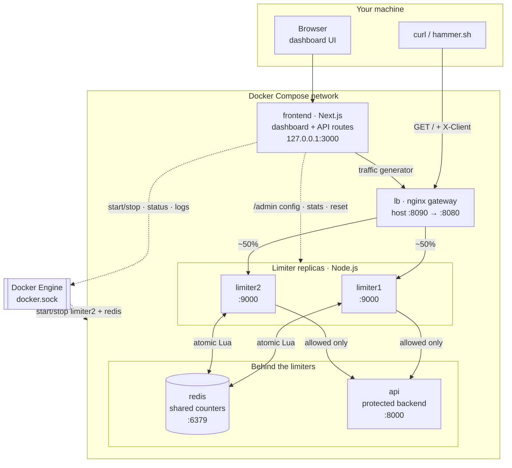
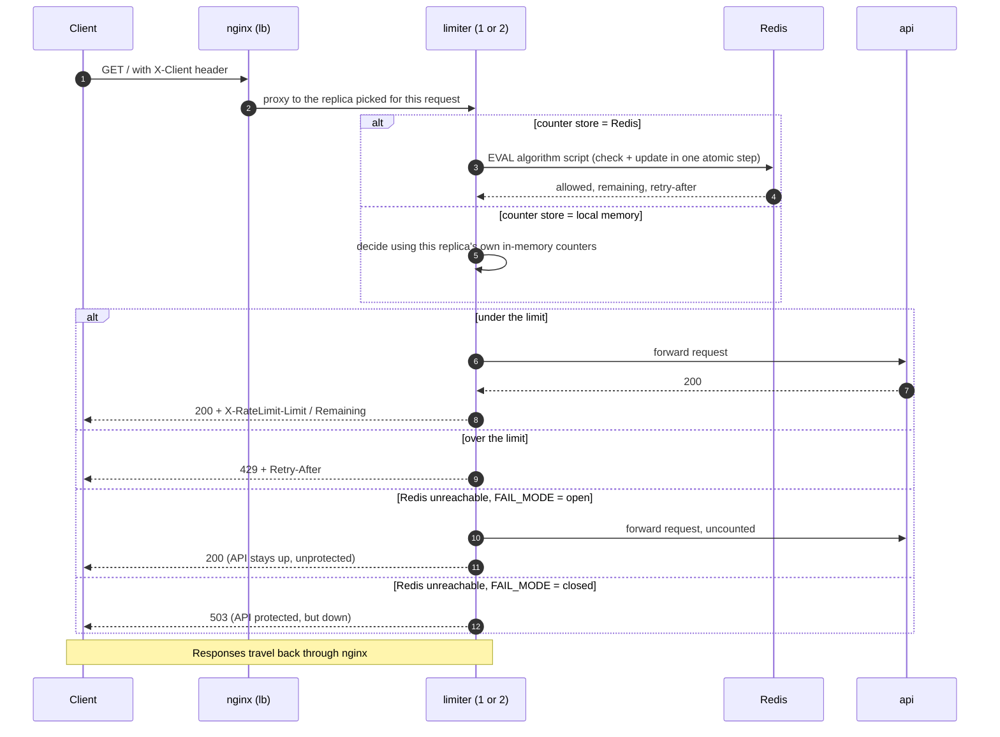
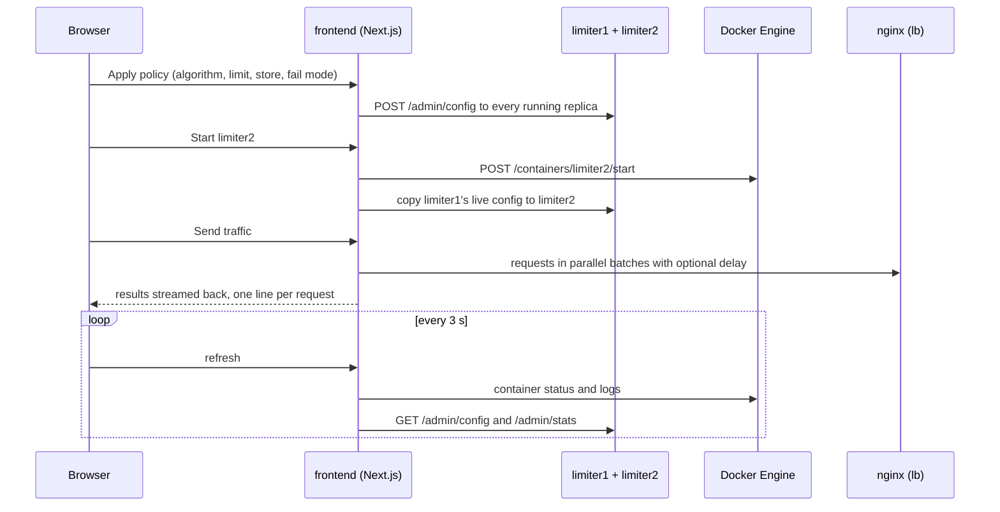

Welcome to the Rate-Limit It hands-on lab!

> **Stack note**: the limiter and api services are Node.js + Express
> (`backend/limiter`, `backend/api`). Run them locally with `npm run dev` (nodemon
> restarts on save); Docker always runs the production `node index.js`. A Next.js
> dashboard in `frontend/` lets you run every step below by clicking buttons instead
> of typing commands; see [frontend/README.md](frontend/README.md).

## Architecture

### Components

Solid arrows are the **request path** (traffic being rate limited). Dotted arrows are the
**control plane** (the dashboard configuring and observing the system).



| Component | Tech | Port | Responsibility | Code |
| --- | --- | --- | --- | --- |
| **lb** | nginx | `8090` on host → `8080` | The gateway. Picks a limiter replica per request (~50/50), re-resolving DNS each time so `limiter2` can come and go, and falls back to `limiter1` if the pick is down. Forwards `X-Client`. Returns 404 for `/admin`. | [backend/lb/nginx.conf](backend/lb/nginx.conf) |
| **limiter1 / limiter2** | Node.js + Express | `9000` (internal) | Identifies the client (`X-Client` header, else IP), runs the configured algorithm, proxies allowed requests to `api`, answers `429` + `Retry-After` when over the limit, adds `X-RateLimit-*` headers, logs one ALLOW/DENY line per request, and serves the admin API. | [backend/limiter](backend/limiter) |
| **redis** | Redis 7 | `6379` (internal) | The shared counter store. Each decision is a single Lua script, so check-and-update is atomic across replicas. Keys expire on their own. | — |
| **api** | Node.js + Express | `8000` (internal) | The protected backend. Returns `{"ok": true}`; it exists so the limiter has something to guard. | [backend/api](backend/api) |
| **frontend** | Next.js 16 | `127.0.0.1:3000` | Dashboard UI plus server-side API routes: traffic generator, limiter admin, guided scenarios, Docker control, logs. | [frontend](frontend) |
| **Docker Engine** | — | socket | Mounted into `frontend` so the dashboard can start/stop `limiter2` and `redis` (scaling and outages) and read container logs. | — |
| **hammer.sh** | sh + curl | — | CLI load generator: N requests as one client, counts 200 vs 429. | [hammer.sh](hammer.sh) |

### Request lifecycle



Why the counter store matters: with **local memory**, each replica counts only the
requests it happens to receive, so two replicas let through up to 2× the limit. With
**Redis**, both replicas run the same atomic script against the same key, so the limit
holds globally, even when both decide at the same instant.

### Algorithms and their state

Selectable live from the dashboard (or the `ALGORITHM` env var). Each has an in-memory
and a Redis implementation with identical behaviour
([backend/limiter/src/algorithms.js](backend/limiter/src/algorithms.js)).

| Algorithm | State kept per client | Redis key | Behaviour |
| --- | --- | --- | --- |
| Fixed window | One counter per calendar window | `rate:<client>:<window>` | Cheapest. Resets at the boundary, so up to 2× the limit can pass across it. |
| Sliding log | Timestamp of every allowed request (sorted set) | `rate:sl:<client>` | Exact rolling window. Memory grows with the limit. |
| Sliding window counter | Current + previous window counters | `rate:sw:<client>:<window>` | Weights the previous window by its overlap. Near-exact with O(1) memory. |
| Token bucket | Token count + last refill time (hash) | `rate:tb:<client>` | Allows a burst of `limit`, then a steady `limit ÷ window` rate. |

### Control plane (dashboard)



Settings changed this way live in each limiter's memory; the env vars in
`docker-compose.yml` are only the starting values.

## Running locally

```bash
docker compose up -d --build
```

- **Dashboard**: http://localhost:3000
- **Rate-limited API**: `curl -i -H 'X-Client: me' localhost:8090/`
- **Stop**: `docker compose down`

The dashboard mounts the Docker socket so it can start/stop containers and read logs,
which is root-equivalent access to Docker, so it's bound to `127.0.0.1` only.

### What you can do from the dashboard

- **Guided lab**: one click per README step (single limiter, the race, the Redis fix,
  fail-open, fail-closed, token bucket). Each sets up containers and policy, resets
  counters, sends traffic and shows what to expect.
- **Limiter policy, applied live** to both replicas without restarting anything:
  - algorithm: fixed window, sliding log, sliding window counter, token bucket
  - limit and window
  - counter store: local memory or Redis (shared)
  - fail open / fail closed
- **Infrastructure**: start/stop `limiter2` and the Redis container.
- **Traffic generator**: requests, parallelism, delay between batches, number of distinct
  clients. Results stream in live as a timeline, per-replica breakdown and stats.
- **Compare all algorithms**: runs the same traffic once per algorithm, side by side.
- **Container logs** with ALLOW / DENY / REDIS DOWN highlighted.

The env vars in `docker-compose.yml` (`ALGORITHM`, `RATE_LIMIT`, `WINDOW_SECONDS`,
`REDIS_ENABLED`, `FAIL_MODE`) are only the starting values; dashboard changes are kept in
each limiter's memory and reset when the container is recreated.

### Limiter admin API

Each limiter exposes `GET/POST /admin/config`, `GET /admin/stats` and `POST /admin/reset`
on port 9000. nginx returns 404 for `/admin`, so it's only reachable from inside the
Docker network (which is how the dashboard uses it).

A small limiter service sits in front of an API, behind an nginx load balancer, exactly the gateway placement from the video. The limiter counts each client's requests in a fixed window (limit 10 per 60s) and answers over-limit calls with 429 + Retry-After. The counters start out in-process memory, and that's the whole point: you'll run ONE limiter and watch the limit hold, add a SECOND limiter and watch 2× the allowed traffic get through, then fix it with a shared atomic Redis counter—and finish by breaking Redis to feel fail-open vs fail-closed.

The stack lives in /Rate-Limiter as a docker-compose project: lb (nginx on port 8090), limiter1/limiter2, api, and redis. Fire traffic with the helper ./hammer.sh.

Learning outcomes:

Enforce a per-client limit and read ALLOW/DENY decisions from logs
Reproduce the distributed-counting race—two replicas, two private counters
Fix it with an atomic shared counter (Redis INCR)
Decide fail-open vs fail-closed when the counter store dies

---

From /Rate-Limiter, bring up everything except limiter2; one limiter is enough for now:

cd /Rate-Limiter
docker compose up -d lb limiter1 api redis
sleep 5
curl -si -H 'X-Client: me' localhost:8090/ | grep -E 'HTTP|X-RateLimit'

You should get a 200 from the api, plus X-RateLimit-Limit: 10 and a shrinking X-RateLimit-Remaining—the limiter is counting you.

---

One limiter, one truth. Hammer the API as a single client and watch the limit hold exactly:

cd /Rate-Limiter
CLIENT="blocked-demo-$(date +%s)"
./hammer.sh 30 "$CLIENT"
docker compose logs limiter1 | tail -15
curl -si -H "X-Client: $CLIENT" localhost:8090/ | grep -E 'HTTP|Retry-After'

The hammer fires 30 requests as one fresh client: exactly 10 allowed, 20 denied with 429. The limiter1 log shows the story: ALLOW ... 1/10 up to 10/10, then a wall of DENY ... -> 429. The final curl reuses that same, now-exhausted client and shows the 429 carrying Retry-After; a polite limiter tells clients when to come back.

---

The fail moment: scale the limiter. Traffic doubled, so you do what everyone does: add a second replica.

cd /Rate-Limiter
docker compose up -d limiter2
sleep 3
./hammer.sh

Same limit, same single client, but now the hammer reports about 20 allowed. nginx round-robins the 30 requests across both limiters, each keeps its own private counter, sees ~15 requests, and happily allows its full 10. Check both logs, and you'll find each replica convinced it did its job:

docker compose logs limiter1 | tail -5
docker compose logs limiter2 | tail -5

---

The fix—one shared counter. Each limiter has a flag that decides whether it counts requests locally (in its own memory) or against a shared store both replicas can see. Point BOTH limiters at that shared store in /Rate-Limiter/docker-compose.yml, recreate them, and hammer again:

cd /Rate-Limiter
docker compose up -d limiter1 limiter2
sleep 3
./hammer.sh

Back to exactly 10 allowed: both replicas now INCR the same key (rate:<client>:<window>) in Redis, and INCR is atomic, so there's no read-then-write race even when both limiters count at the same instant. The logs now say (redis) instead of (local).

---

Break the counter store. The limit now depends on Redis. So, what happens when Redis dies? Stop it and send traffic:

cd /Rate-Limiter
docker compose stop redis
./hammer.sh
docker compose logs limiter1 | tail -5

All 30 requests get through; the limiter logs REDIS DOWN — failing OPEN (request allowed, uncounted). This stack is configured fail-open: when the limiter can't count, it lets traffic pass rather than turning a Redis outage into a full API outage.